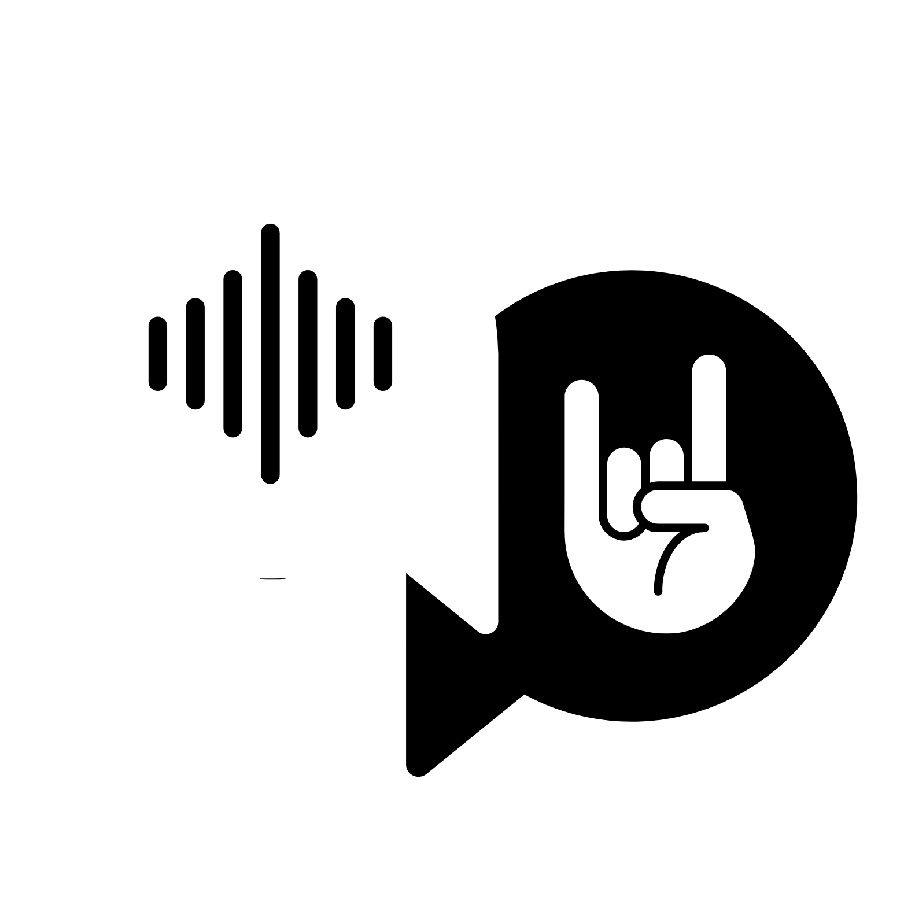

# Signify 🤟

<div align="center">
  
  
  **Bridging Communication Through Technology**
  
  [](https://flutter.dev)
  [](https://firebase.google.com)
  [](https://supabase.com)
  [](https://www.python.org/)
  [](https://opensource.org/licenses/MIT)
</div>

---

## 🚀 About Signify

**Signify** is a revolutionary accessibility platform designed to break down communication barriers between the Deaf/Hard-of-Hearing (DHH) community and the hearing world. By leveraging cutting-edge AI and computer vision, Signify provides a seamless, bidirectional bridge for real-time communication.

### 🎯 The Mission

To empower individuals with hearing and speech impairments by providing inclusive tools that convert sign language into spoken/written word and vice-versa, fostering independence in education, healthcare, and daily interactions.

---

## 🎥 Animated Video

Here is a demonstration of what Signify does

https://github.com/user-attachments/assets/02f97a65-7394-4ef5-a9ef-95b118944777

---

## User Flow


## ✨ Key Features

### 🎥 **Sign-to-Voice (S2V)**

- **Real-time Recognition**: Processes camera feed to identify Indian Sign Language (ISL) gestures.
- **AI-Powered Inference**: Uses MediaPipe and RandomForest classifiers for high-accuracy gesture detection.
- **Multilingual Output**: Converts recognized signs into text and speech in 8+ regional languages.

### 🎙️ **Voice-to-Sign (V2S)**

- **Speech/Text Recognition**: Captures spoken words using high-fidelity STT.
- **3D Animation**: Translates words into fluid sign language demonstrations using a built-in 3D model viewer.
- **Customizable Speed**: Adjust playback to learn or communicate at your own pace.

### 🔍 **Smart Utilities**

- **ISL Dictionary**: A comprehensive resource for learning standardized Indian Sign Language.
- **OCR Scanner**: Extract text from physical documents and translate them into signs instantly.

---

## 🏗 System Architecture

Signify is designed around a hybrid cloud architecture, combining on-device ML/APIs with cloud-hosted backend systems to guarantee high performance and real-time processing.

```mermaid
graph TD
    %% Frontend Client Layer
    subgraph Client [Flutter Mobile App]
        UI([App User Interface])
        STT([Speech-to-Text STT])
        TTS([Text-to-Speech TTS])
        OCR([Google ML Kit OCR])
        Viewer3D([Model Viewer Plus 3D])
    end

    %% Backend Services Layer
    subgraph Cloud_Backend [Cloud & Backend Services]
        Firebase_Auth([Firebase Auth])
        Firestore[(Cloud Firestore<br/>Prefs & History)]
        Supabase_DB[(Supabase PostgreSQL<br/>Dictionary Metadata)]
        Supabase_Storage[(Supabase Storage<br/>3D Models .glb)]
    end

    %% Machine Learning Layer
    subgraph ML_Services [AI & ML Pipeline]
        ML_API([Python ML API<br/>Hosted / Local Flask])
        MediaPipe([MediaPipe Landmark Detection])
        RF_Models([RandomForest Classifiers])
    end

    %% Data Flows
    UI -->|1. Transmits JPEG Frames| ML_API
    ML_API -->|2. Extracts Landmarks| MediaPipe
    MediaPipe -->|3. Predicts Gesture| RF_Models
    RF_Models -->|4. Returns Sign Text| UI

    UI -->|User Auth| Firebase_Auth
    UI -->|Fetch Preferences/Data| Firestore
    UI -->|Fetch Sign Metadata| Supabase_DB
    UI -->|Load .glb animations| Supabase_Storage

    UI -->|Microphone Input| STT
    UI -->|Audio Output| TTS
    UI -->|Camera Document Scan| OCR
    Supabase_Storage -->|Load Model| Viewer3D

    %% Styling Subgraphs
    style Client fill:#F0F7FF,stroke:#3B82F6,stroke-width:2px,color:#1E3A8A,stroke-dasharray: 5 5
    style Cloud_Backend fill:#FFF9F2,stroke:#F59E0B,stroke-width:2px,color:#78350F,stroke-dasharray: 5 5
    style ML_Services fill:#FAF5FF,stroke:#8B5CF6,stroke-width:2px,color:#4C1D95,stroke-dasharray: 5 5

    %% Styling Nodes
    classDef clientNode fill:#FFFFFF,stroke:#3B82F6,stroke-width:2px,color:#1E3A8A,font-weight:bold;
    classDef firebaseNode fill:#FFFFFF,stroke:#EF4444,stroke-width:2px,color:#7F1D1D,font-weight:bold;
    classDef supabaseNode fill:#FFFFFF,stroke:#10B981,stroke-width:2px,color:#064E3B,font-weight:bold;
    classDef mlNode fill:#FFFFFF,stroke:#8B5CF6,stroke-width:2px,color:#4C1D95,font-weight:bold;

    class UI,STT,TTS,OCR,Viewer3D clientNode;
    class Firebase_Auth,Firestore firebaseNode;
    class Supabase_DB,Supabase_Storage supabaseNode;
    class ML_API,MediaPipe,RF_Models mlNode;

    %% Styling Links
    linkStyle 0,1,2,3 stroke:#8B5CF6,stroke-width:2px;
    linkStyle 4,5 stroke:#EF4444,stroke-width:2px;
    linkStyle 6,7,11 stroke:#10B981,stroke-width:2px;
    linkStyle 8,9,10 stroke:#3B82F6,stroke-width:2px;
```



### **Data Pipeline**

1. **Sign-to-Voice (S2V)**:
   - **Capture**: The Flutter app's camera controller captures feed frames.
   - **Transmission**: The app encodes frames as JPEG byte lists and posts them to the Python ML API (Flask server on Hugging Face / localhost).
   - **Feature Extraction**: The Python backend uses MediaPipe to extract coordinates (landmarks) for hands and body pose.
   - **Classification**: RandomForest classifiers process coordinates to predict gestures, returning the identified sign to the client.
   - **Output**: The app appends the predicted word to the sentence, translates it if necessary, and optionally reads it aloud via Text-to-Speech (TTS).

2. **Voice-to-Sign (V2S)**:
   - **Capture**: The microphone captures user speech, which is converted to text using high-fidelity Speech-to-Text (STT).
   - **Mapping**: The app splits the sentence into words and queries Supabase / local dictionary to map them to specific 3D model paths (`.glb` files).
   - **Animation**: The 3D avatar is updated sequentially using `model_viewer_plus` with a minor crossfade duration to swap models fluidly.

### App Demo

https://github.com/user-attachments/assets/009d8fb2-f18b-496c-840e-8320315a65c0

### ML Model Demo

https://github.com/user-attachments/assets/efc191f6-4b3e-4f33-bd91-20a89f4dacce

---

## 🛠 Tech Stack

| Category              | Technologies                                                          |
| --------------------- | --------------------------------------------------------------------- |
| **Frontend**    | Flutter, Dart, Go Router, Provider                                    |
| **Backend**     | Firebase (Auth, Firestore, Storage, Analytics), Supabase (PostgreSQL) |
| **ML & Vision** | MediaPipe, Google ML Kit (OCR), Scikit-learn (RandomForest)           |
| **Animations**  | Model Viewer Plus (3D), Lottie, Flutter Animate                       |
| **Audio**       | Speech To Text (STT), Flutter TTS                                     |

---

## 📚 Supported Vocabulary

Signify currently supports a robust set of **30+ ISL signs**, including:

- **Basics**: Sun, Help, Teacher, Support, Paper, Love, Water.
- **Actions**: Accident, Yes, Eat, Go, Dance.
- **Descriptive**: Thick, High, Poor, Important, Deaf, Winner, Deep, Loud, Flat, Slow, Sad.
- **Educational**: ISL, Friend, School, Pizza.

---

## 📦 Installation

### **Prerequisites**

- Flutter SDK (≥ 3.9.0)
- Python 3.8+ (for the ML API)
- Android Studio / Xcode

### **Setup**

1. **Clone the repository:**

   ```bash
   git clone https://github.com/swastikbansal/Signify.git
   cd Signify
   ```
2. **Install Flutter dependencies:**

   ```bash
   flutter pub get
   ```
3. **Configure Firebase:**

   - Place your `google-services.json` in `android/app/`.
   - Place your `GoogleService-Info.plist` in `ios/Runner/`.

4. **Configure Environment Variables:**

   All credentials are loaded from a local `.env` file at **compile time** using `--dart-define-from-file`. This keeps secrets out of the source code.

   ```bash
   # Copy the example file
   cp .env.example .env
   ```

   Then edit `.env` and fill in your credentials.


5. **Run the App:**

   You **must** pass `--dart-define-from-file=.env` when running or building the app. Without it, all credentials will be empty and the app will fail to start.

   ```bash
   # Run on a connected device / emulator
   flutter run --dart-define-from-file=.env

   # Build APK
   flutter build apk --dart-define-from-file=.env

   # Build App Bundle (for Play Store)
   flutter build appbundle --dart-define-from-file=.env

   # Build for Web
   flutter build web --dart-define-from-file=.env
   ```

   **Android Studio Tip:** To avoid typing the flag every time, go to **Run → Edit Configurations** and add `--dart-define-from-file=.env` in the **Additional run args** field.

---

## 🎮 Usage

1. **Launch Signify**: Complete the onboarding and sign in (Anonymous or Social).
2. **Choose Mode**: Select "Sign to Voice" for gesture recognition or "Voice to Sign" for animations.
3. **Calibrate**: For Sign-to-Voice, ensure good lighting and position yourself within the camera frame.
4. **Dictionary**: Explore the "ISL Dictionary" to learn new signs.

---

## 🗺 Roadmap

- [ ] Expansion to 100+ ISL signs.
- [ ] Offline ML model execution using TFLite.
- [ ] Community-contributed sign definitions.
- [ ] Real-time video call integration with sign translation.

---

## 🤝 Contributors

We welcome and thank all the contributors who make Signify possible!

<table>
  <tr>
    <td align="center">
      <a href="https://github.com/swastikbansal">
        <br />
        <sub><b>swastikbansal</b></sub>
      </a>
    </td>
    <td align="center">
      <a href="https://github.com/barnes-vidit">
        <br />
        <sub><b>barnes-vidit</b></sub>
      </a>
    </td>
    <td align="center">
      <a href="https://github.com/yatharth-1907">
        <br />
          <sub><b>yatharth-1907</b></sub>
      </a>
    </td>
      <td align="center">
      <a href="https://github.com/prabhjot0109">
        <br />
          <sub><b>prabhjot0109</b></sub>
      </a>
    </td>
        <td align="center">
      <a href="https://github.com/ujjwal2412">
        <br />
          <sub><b>ujjwal2412</b></sub>
      </a>
    </td>
        <td align="center">
      <a href="https://github.com/zahararangwala">
        <br />
          <sub><b>zahararangwala</b></sub>
      </a>
  </tr>
</table>


---

## 📄 License

This project is licensed under the MIT License - see the [LICENSE](LICENSE) file for details.

---

<div align="center">
  <p><strong>Developed with ❤️ by the Signify Team</strong></p>
